# 🚀 Full-Stack Template

<div align="center">
  


*Production-ready full-stack template with clean architecture and complete authentication*

</div>

## ✨ Features

- 🔐 **Complete Authentication** - Signup → Signin → OTP → JWT Session with auto-refresh
- 🏗️ **Clean Architecture** - Domain-driven design with dependency injection
- 🛡️ **Security First** - JWT tokens, HTTP-only cookies, rate limiting, bcrypt
- 🎨 **Modern UI** - Radix UI, Tailwind CSS, dark/light themes, responsive
- ⚡ **Developer Experience** - TypeScript, hot reload, testing ready
- 📧 **Email Integration** - OTP verification and password reset via Nodemailer

## 🔐 Authentication Flow

```mermaid
graph TB
    A[👤 Sign Up] --> B[📧 Email, Password, Name]
    B --> C[✅ Create Account]
    C --> D[🔑 Sign In Page]
    
    D --> E[🔐 Enter Credentials]
    E --> F{Valid?}
    F -->|❌| G[Error Message]
    G --> E
    F -->|✅| H[🔢 Generate OTP]
    H --> I[📧 Send Email]
    I --> J[🔢 OTP Page]
    
    J --> K[Enter OTP Code]
    K --> L{Valid & Fresh?}
    L -->|❌| M[Try Again]
    M --> K
    L -->|✅| N[🎯 Generate JWT]
    N --> O[🍪 Set Cookies]
    O --> P[✨ Authenticated]
    
    P --> Q[🛡️ Protected Routes]
    Q --> R[👤 Profile Access]
    
    S[🔄 Token Expiry] --> T[Auto Refresh]
    T --> P
    
    U[🔒 Forgot Password] --> V[📧 Reset Email]
    V --> W[🔢 OTP Reset]
    W --> D
    
    style A fill:#e3f2fd
    style P fill:#e8f5e8
    style N fill:#fff3e0
    style T fill:#fce4ec
```



## 🛠️ Tech Stack

| Layer | Technology |
|-------|-----------|
| **Frontend** | Next.js 15, React 19, Tailwind CSS, Radix UI |
| **Backend** | Express.js 5, Node.js, JWT Authentication |
| **Database** | MongoDB with Mongoose ODM |
| **Language** | TypeScript (Full Stack) |
| **State** | Zustand + React Query |
| **Email** | Nodemailer |
| **Security** | bcrypt, CORS, Rate Limiting |

## 🚀 Quick Start

### Prerequisites
- Node.js v22+
- pnpm v10.6.4+
- MongoDB (local or Atlas)

### Installation

```bash
# Clone repository
git clone git@github.com:sinanptm/full-stack-template.git
cd full-stack-template

# Install dependencies
pnpm install
```

### Environment Setup

**Server** (`.env` in `server/` directory):
```env
MONGODB_URI=mongodb://localhost:27017/your-database
ACCESS_TOKEN_SECRET=your-secure-access-token-secret
REFRESH_TOKEN_SECRET=your-secure-refresh-token-secret
NODEMAILER_PASSKEY=your-email-app-password
SENDER_EMAIL=your-email@gmail.com
PORT=8000
CLIENT_URL=http://localhost:3000
```

**Client** (`.env.local` in `web/` directory):
```env
NEXT_PUBLIC_SERVER_URL=http://localhost:8000
```

### Start Development

```bash
# Start both frontend and backend
pnpm dev

# Or individually
pnpm --prefix server dev    # Backend: http://localhost:8000
pnpm --prefix web dev       # Frontend: http://localhost:3000
```

## 📁 Project Structure

```
full-stack-template/
├── 📁 server/                 # Backend (Clean Architecture)
│   ├── 📁 src/
│   │   ├── 📁 domain/         # Business entities & interfaces
│   │   ├── 📁 use_case/       # Application logic
│   │   ├── 📁 infrastructure/ # Database & external services
│   │   ├── 📁 presentation/   # Controllers & routes
│   │   └── 📁 di/             # Dependency injection
│   └── 📁 __tests__/          # Test files
├── 📁 web/                    # Frontend (Next.js)
│   ├── 📁 app/                # App router
│   ├── 📁 components/         # React components
│   ├── 📁 hooks/              # Custom hooks
│   └── 📁 lib/                # Utilities
└── 📄 package.json            # Root configuration
```

## 🔐 API Endpoints

### 🔓 Public Routes
- `POST /api/auth/signup` - User registration
- `POST /api/auth/signin` - Login (sends OTP)
- `POST /api/auth/verify-otp` - OTP verification
- `POST /api/auth/forgot-password` - Password reset request
- `POST /api/auth/reset-password` - Reset with OTP

### 🛡️ Protected Routes
- `GET /api/profile` - User profile data
- `POST /api/auth/refresh` - Token refresh (automatic)

## 🏗️ Architecture Highlights

### Clean Architecture Layers
1. **Domain** - Core business logic and entities
2. **Use Cases** - Application-specific operations
3. **Infrastructure** - Database and external integrations
4. **Presentation** - API controllers and routes
5. **DI Container** - Dependency injection with Inversify

### Security Features
- JWT with automatic refresh tokens
- HTTP-only cookies prevent XSS
- bcrypt password hashing
- Rate limiting and CORS protection
- Input validation with Joi schemas

## 🧪 Development

```bash
# Testing
pnpm --prefix server test

# Production build
pnpm --prefix server build
pnpm --prefix web build

# Production start
pnpm --prefix server start
pnpm --prefix web start
```

## 📚 Key Scripts

| Command | Description |
|---------|-------------|
| `pnpm dev` | Start development servers |
| `pnpm format` | Format code with Prettier |
| `pnpm --prefix server test` | Run backend tests |
| `pnpm --prefix web lint` | Lint frontend code |

## 🎨 Customization

- **UI Components**: Modify `web/components/ui/` with Radix primitives
- **Business Logic**: Update use cases in `server/src/use_case/`
- **Database Models**: Edit entities in `server/src/domain/entities/`
- **Themes**: Configure in `web/tailwind.config.js`

## 🤝 Contributing

1. Fork the repository
2. Create feature branch (`git checkout -b feature/name`)
3. Commit changes (`git commit -m 'Add feature'`)
4. Push branch (`git push origin feature/name`)
5. Open Pull Request

---

<div align="center">
  Made with ❤️ for developers • Full-stack template ready for production
</div>